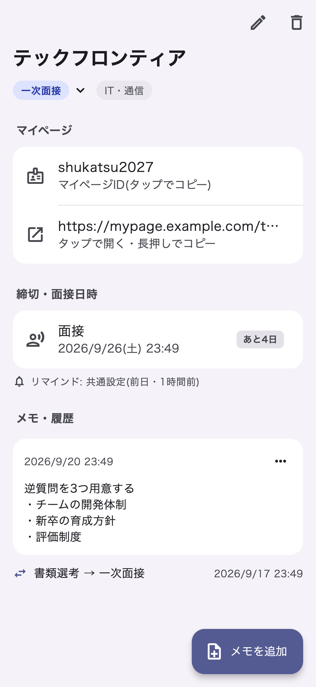
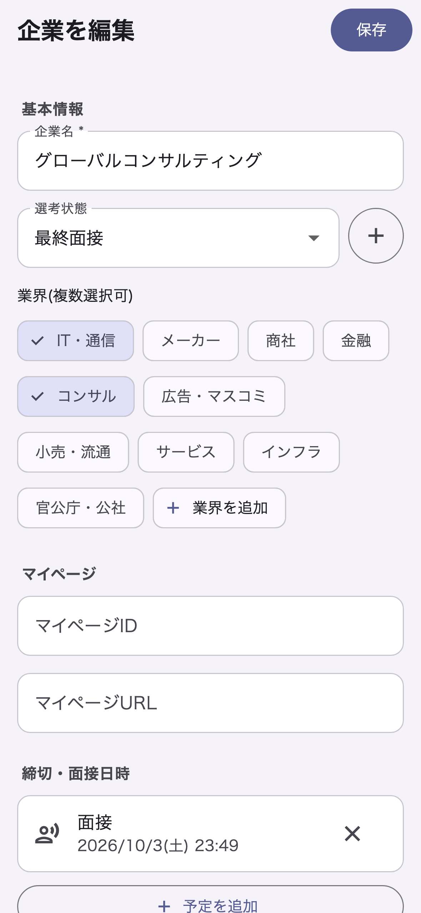

# 選考ノート（就活選考管理アプリ）

就職活動の応募企業・選考状況・予定をまとめて管理する Flutter アプリです。
オフラインで完結するローカル DB 設計で、iOS / Android の両方に対応しています。

<p>
  
  
  
</p>

## Features

- 企業ごとの選考状態・業界・マイページ ID / URL の管理
- 面接などの予定登録とローカル通知によるリマインド（企業ごとに通知タイミングを変更可能）
- 状態変更の履歴とメモのタイムライン
- 選考状態・業界の追加・名前変更・並べ替え・削除
- CSV のエクスポート / インポート
- 削除の取り消し（Undo）

## Tech Stack

- Flutter / Dart 3
- [Riverpod](https://riverpod.dev/)（状態管理）
- [drift](https://drift.simonbinder.eu/)（SQLite）
- flutter_local_notifications

## Getting Started

```bash
flutter pub get
flutter run
```

DB スキーマ（`lib/data/database.dart`）を変更したら、コードを再生成してください。

```bash
dart run build_runner build
```

## Tests

```bash
flutter test
```

企画・仕様書は [docs/planning_spec.md](docs/planning_spec.md)、仕様の判断メモは [docs/spec_decisions.md](docs/spec_decisions.md) にあります。
